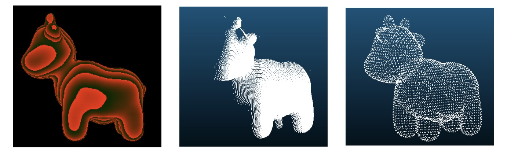
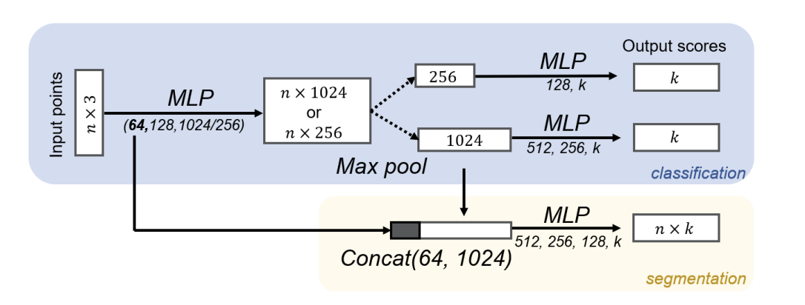
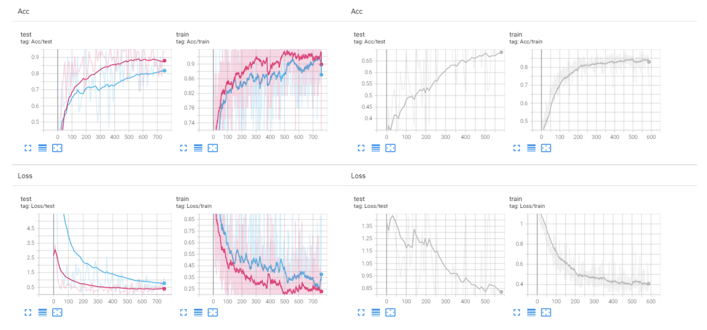
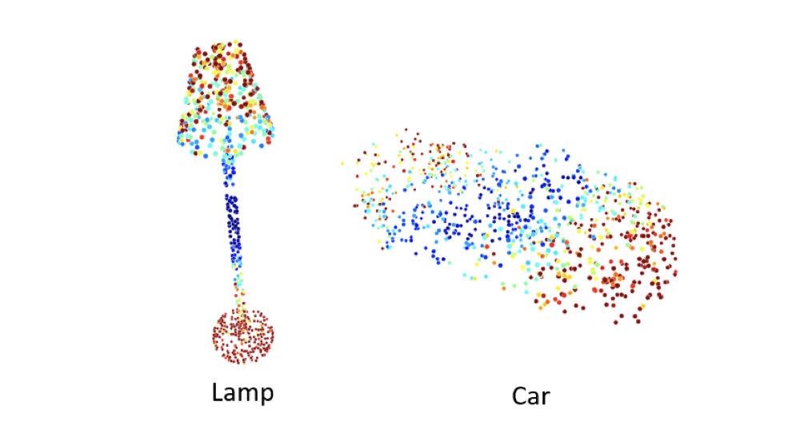
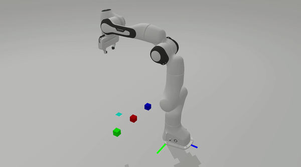

# Assignment 3

This assignment includes 3 tasks: 

- Transforming a depth image to a point cloud
- Implementing and training a PointNet for classification and segmentation
- Picking and placing an object with Sapien

The objective of this assignment is to get you familiar with processing 3D data and coding the basic deep learning-based algorithms of 3D vision. 

## 1. Backprojection: Transform a Depth Image to a Point Cloud

In this question, you are required to transform a depth image to a point cloud. The depth image is synthesised by a standard perspective camera.

<figure>
  
  <figcaption>img/Fig 1. Left: raw depth image. Middle: transformed partial point cloud with another viewpoint. Right:
ground truth complete point cloud.</figcaption>
</figure>


After backprojection, compute the one-way Chamfer distance from your generated partial point cloud to the ground truth complete point cloud. You are required to only use Numpy to finish this task. Note that for-loop is not allowed.

We recommend using [this repo](https://github.com/j2kun/earthmover/) to compute earth move distance between two point clouds.
```bash
1_Backprojection
git clone git@github.com:j2kun/earthmover.git
```

## 2. PointNet

PointNet is the most widely adopted neural network for point cloud learning. In this question, you are requested to implement the pipeline of PointNet for both classification and segmentation tasks on ShapeNetPart1 and then visualize the features. Please read and follow the README to prepare the environment and dataset.

<figure>
  
  <figcaption>img/Fig 2. PoinNet architecture for both classification and segmentation tasks.</figcaption>
</figure>

### Points Classification and Segmentation. 

First of all, you need to build the PointNet by following the architecture in Fig.2. In implementation, you will build separate networks for different tasks with different feature dimensions. We provide the off-the-shelf data-loaders of ShapeNetPart for both classification and segmentation tasks. The training process may take you about 20 minutes. The content of this question can be found in `model.py`. 

- For segmentation task, your network should predict the part labels of the given point cloud. Specifically, we consider the ”airplane” category. Please refer to train `segmentation.py` for more details. 
- For classification task, your network should predict the category of given point clouds. Besides, we want you to investigate the effect of the dimensions of the global feature. So in this classification part, you are requested to train two separate PointNets. One is the original PointNet with 1024D global feature. And another one uses 256D global feature. You will have a similar training curve as Fig.3. Please check train `classification.py` for more details and submit the screenshot.

<figure>
  
  <figcaption>Fig 3. Classification task with 1024D (pink) and 256D (blue) global feature. Segmentation task with 1024D global feature (gray).</figcaption>
</figure>
<figure>
  
  <figcaption>Fig 4. Feature visualization with colormap. Your results may not be exactly the same.</figcaption>
</figure>

### Point Feature Visualization

We have already trained some networks and draw lots of curves. But sometimes, we want a more comprehensive way to understand what the network actually learned. So in this question, you are required to visualize the cruciality of $n\times1024$ points feature before max-pooling in the classification network (1024D). And the cruciality is simply defined as the maximum value along the point feature dimensions. The colormap and points-to-ply functions are provided and you can obtain similar colored point clouds as Fig.4. please see `classficiation1024D_feat_vis.py` for more details.

### Commands
#### Dataset
- Download and unzip ShapePartNet dataset from [here](http://web.stanford.edu/~ericyi/project_page/part_annotation/index.html).
  
```bash
wget https://shapenet.cs.stanford.edu/ericyi/shapenetcore_partanno_segmentation_benchmark_v0.zip --no-check-certificate
unzip shapenetcore_partanno_segmentation_benchmark_v0.zip
```
#### Data Configuration
Open `HM_PointNet/utils.py`, and you can modify the dataset and output path:
```
dataset = "your_path\shapenetcore_partanno_segmentation_benchmark_v0"
outf = "your_path\PointNet\results"
```

#### Visualization

- Train network and visualize the curves
```bash
cd your_path/PointNet/results
tensorboard --logdir .
```

## 3. SAPIEN

**Please follow the instructions of assignment 2 to set up the environment.** This assignment is adpated from Prof. Hao Su's course in UCSD.

### Instruction
The goal of this assignment is to achieve:
- move the end-effector dynamically to a given target pose. We make a simplification and you only need to pick the first two boxes (red and green).



The starter code provides these files:
- [A3.py](A3.py): run this file to debug and evaluate; not necessary to modify
- [A3_env.py](env/A3_env.py): implement this file
- [stacking_env.py](env/stacking_env.py): provide basic functions; not necessary to modify

### Overview
In this assignment, instead of implementing complex motion planning, we introduce a relative simple method to move the end-effector dynamically to a given target pose. The method should be implemented in `move_to_target_pose_with_internal_controller` following several steps:
1. For each time step, compute the relative transformation from the current end-effector pose to the target pose `target_ee_pose`. Note that the transformation is described in the body frame.
2. Compute the exponential coordinate of the relative transformation by `pose2exp_coordinate`. The exponential coordinate can be decomposed into the `unit_twist` and the angle `theta`. Given the time left to approach the target, you can compute the average `body_twist = unit_twist * (theta / time_to_target)`.
3. Convert the body twist to the spatial twist. Note that the spatial frame is the same as the robot base frame.
3. Compute the joint velocities `qvel` from the spatial twist by `compute_joint_velocity_from_twist`. Jacobian is provided in the function.
4. Call `internal_controller` to execute the joint velocities `qvel`.
    > Concretely, it computes the target joint poses `qpos` by adding `qvel * timestep` to the current joint poses. Given the target joint poses and velocities, the Sapien engine can compute the generalized force `qf` to achieve the velocities.

### Pick and place boxes
`pick_up_object_with_internal_controller` should be implemented to pick up a box. Similar to homework1, you should compute the position of the box given its point cloud. Then you need to call `move_to_target_pose_with_internal_controller` to move the end-effector to approach the box, and call `close_gripper` to grasp the box. Next you need to lift the box to a certain height (move the end-effector along the z-axis).

`place_object_with_internal_controller` should be implemented to place the box to the target position. Concretely, you need to move the end-effector so that the box is located at the target position, and call `open_gripper` to release the box.

### Functions to implement
It is suggested to implement the following functions in order.
- pose2mat
- pose2exp_coordinate
- compute_joint_velocity_from_twist
- move_to_target_pose_with_internal_controller
- pick_up_object_with_internal_controller
- place_object_with_internal_controller

### Grading
The assignment will be evaluated by running hw2.py to check the correctness.
The detailed rubric is listed as follows:
- Implement `move_to_target_pose_with_internal_controller` correctly: 50%
- Successfully pick and place two boxes with the internal controller: 30%
- Successfully pick and place the last box with the user controller: 20%

It is not necessary to import extra libraries. You will also lose points if you use `scipy` and `transform3d`. Late submission will also lose points.


**Please include the following results in your report:** 

- Screenshots/logs of your training process.

## Submission

- Compress the entire folder with all the codes **except** datasets, training logs, checkpoint weights.

- Submit a brief report which contains the results of each task.

- Rename the compressed folder to **Name_ID.zip** and submit to [course.pku.edu.cn](https://course.pku.edu.cn/).


